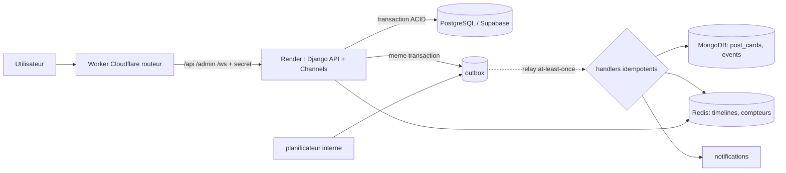

# ARCHITECTURE_DATA — LE BAOBAB

## 1. Principe : une seule source de verite par donnee

| Domaine | Source de verite | Read-model / projection | Cache / ephemere | Reconstruction |
|---|---|---|---|---|
| Identite, profils, amis, groupes | PostgreSQL | — | Redis : cache de permissions (TTL 120 s) | n/a (c'est la verite) |
| Messages | PostgreSQL (`seq` par trigger) | — | Redis : presence, typing, non-lus chauds, channel layer | non-lus : `message_seq - last_read_seq` |
| Posts, commentaires, reactions, statuts | PostgreSQL | MongoDB `post_cards` | Redis : timeline (ZSET d'IDs), compteurs de vues | `feed.rebuild_timeline`, `feed.hydrate` |
| Notifications | PostgreSQL | — | Redis : compteur non-lus, push WebSocket | recompte depuis PG |
| Audit, moderation | PostgreSQL (tables append-only) | — | — | n/a |
| Evenements analytiques | MongoDB `events` (TTL) | PG `analytics_daily_metric`, vues materialisees | — | agregats recalculables (`refresh_metrics`) |
| Idempotence | PostgreSQL `core_idempotency_record` | — | Redis : verrou court (anti double-clic) | la base fait foi |

Regle d'or : **Redis n'est jamais la seule copie d'une donnee**. Chaque cle Redis a un TTL (verifie par test) ou est reconstructible.

## 2. Flux

Ecriture typique (publier un post) : `create_post` ecrit post + medias + hashtags + **evenement outbox** dans UNE transaction PostgreSQL.
Le relais (`relay_outbox`, thread interne toutes les 3 s tant que le service est eveille) projette ensuite la carte dans MongoDB, pousse l'ID dans les timelines Redis, et cree les notifications.
Si MongoDB ou Redis sont indisponibles, l'ecriture reussit ; l'evenement est rejoue avec backoff (8 essais) puis marque `failed` (visible dans l'admin).

## 3. Coherence

| Donnee | Modele | Pourquoi |
|---|---|---|
| Paiement, commande, adhesion, droits | **Forte** (transaction + contraintes UNIQUE + `select_for_update`) | un doublon coute de l'argent ou ouvre un acces |
| Compteurs de likes/commentaires | Forte en base (triggers) ; **eventuelle** dans la carte Mongo | affichage tolere quelques secondes de retard |
| Vues | Eventuelle (Redis -> flush minute) | volume |
| Typing | Ephemere (TTL 6 s) | jamais persiste |
| Analytics | Eventuelle | agregats recalculables |
| Visibilite d'un post | **Toujours re-verifiee en base** a la lecture du feed | une timeline Redis perimee ne doit jamais faire fuiter un contenu |

## 4. Decisions qui corrigent le cahier des charges initial
1. **Messages en PostgreSQL**, pas MongoDB : ordre total par conversation, autorisation par jointure, integrite. Redis n'est que temps reel.
2. **`MessageRead` remplace par des pointeurs** (`last_read_seq`, `last_delivered_seq`) : O(membres) au lieu de O(messages x membres).
3. **Like et Reaction fusionnes** (un like = reaction de type `like`). **Technology = Skill**.
4. **Pas d'app `channels`** (conflit avec le paquet Django `channels`) : les channels vivent dans `community`.
5. **`APIRequestLog` en MongoDB + TTL 30 j**, pas en PostgreSQL (volume, faible valeur individuelle).
6. **Modele d'amitie : une ligne par paire** (`user_low < user_high`), pas deux lignes miroir.
7. Index (conversation, -seq) **supprime** : la contrainte UNIQUE(conversation, seq) fournit deja l'index (verifie par `EXPLAIN` dans les tests).

## 5. Monolithe modulaire -> microservices
Regles appliquees : pas de FK entre domaines "lointains" (references par UUID : `classroom_ref`, `ref_id`), evenements outbox plutot qu'appels directs,
`moderation` ne connait aucun autre domaine (registre de hooks), services/selectors comme seules interfaces.
Extractions probables dans l'ordre : `messaging` (WebSocket intensif) -> `notifications` -> `analytics` -> `advertising`.
Les evenements de l'outbox deviennent alors des messages vers un broker (Queues Cloudflare, Kafka, ...) sans reecrire les producteurs.

## 5 bis. Domaine Education : decisions
- **Prix a trois niveaux** (cours, module, chapitre) + classroom payante. `Chapter.is_free` est l'**autorite** ; un droit sur le chapitre, son module, son cours ou sa classroom le debloque. Un module payant peut contenir des chapitres gratuits (apercu) et inversement. CHECK en base : gratuit => pas de prix ; payant => prix > 0 et devise.
- **Droits idempotents** (`grant_key` UNIQUE) : un webhook de paiement rejoue ne cree jamais deux droits. Le futur domaine marketplace n'appelle que `grant_entitlement`.
- **Decision d'acces explicite** (`access_decision`) : `not_published`, `membership_required`, `classroom_payment_required`, `enroll_required`, `payment_required` — l'API sait quoi proposer a l'utilisateur.
- **Progression** : une seule table de verite (`ChapterProgress`) ; module/cours sont calcules en SQL. Pourcentage monotone, temps plafonne par appel.
- **Certificats** : un certificat valide par (utilisateur, cours) garanti par la base ; code public verifiable (limite par IP, aucune donnee privee exposee) ; emis seulement si le cours est termine ET tous les quiz publies sont reussis (reaction a l'evenement `QuizPassed`, sans import circulaire).
- **Quiz** : correction automatique (choix unique/multiple, vrai/faux, texte normalise sans accents ni casse, mise en ordre) ; code = correction manuelle ; les bonnes reponses ne sortent jamais par les serializers (teste).
- **Devoirs** : individuels ou en groupe (un groupe par eleve et par devoir, garanti en base), plusieurs tentatives numerotees sous verrou, retard marque ou refuse, grille de notation (somme des criteres = total).

## 5 ter. Commerce, recrutement, publicite : decisions
- **Argent en entiers** (plus petite unite), jamais de flottants. Publicite : depense en **micro-unites** (le CPM par impression ne perd aucun centime) ; le reste fractionnaire est reporte d'un reglement au suivant.
- **Prix figes** : `OrderItem` copie titre, SKU et prix ; changer un prix ne reecrit jamais l'historique. Remise repartie au centime (methode du plus grand reste) ; commission arrondie en faveur du vendeur.
- **Aucun surstock** : `CHECK stock >= 0`, variantes verrouillees dans un ordre fixe (pas d'interblocage). Teste avec 8 achats simultanes pour 3 unites.
- **Paiement** : un seul paiement reussi par commande (index unique partiel) ; montant et devise recontroles ; paiement tardif sur commande annulee signale (`PaymentOrphaned`), jamais ignore ; webhook : signature HMAC obligatoire (secret vide = refus), deduplication par `event_id`.
- **Grand livre** : ecritures signees, en ecriture seule, lot a somme nulle verifie a la validation (trigger differe). Remboursements = ecritures inverses proportionnelles.
- **Marketplace <-> education sans import** : un achat publie `OrderPaid` ; le domaine education accorde le droit (idempotent) ; un remboursement complet publie `OrderRefunded` et le droit est revoque. La cible vendable est validee par un registre (`core.registries`).
- **Candidatures** : machine a etats (matrice de transitions), historique inalterable, une candidature par (offre, candidat) garantie en base. **Entretiens** : exclusion de chevauchement + reservation sous verrou.
- **Publicite** : verites separees. Redis = plafonds de frequence et garde-fous de budget (reconstructibles, initialises depuis PostgreSQL) ; MongoDB = evenements bruts (TTL 60 j, IP jamais en clair) ; **PostgreSQL = reglements** (`AdSettlement`, unique par lot) et portefeuille. Reglement : RENAME atomique des accumulateurs vers un lot, application en base idempotente, lot rejouable apres plantage. Panne de Redis : au pire sous-facturation, jamais de facturation en double ni de dette.
- **Vie privee** : ciblage restreint par `CHECK` a 12 criteres autorises (aucune donnee sensible) ; l'utilisateur peut refuser la publicite personnalisee (il ne recoit alors que des annonces sans ciblage) ; aucune annonce ne diffuse sans validation humaine (`CHECK active => reviewed_at`).

## 6. Perimetre de cette tranche
Implemente : core, accounts, profiles, friends, community, messaging, social, notifications, audit, moderation, integrations, analytics, education, assessments, progress, **marketplace, payments, companies, portfolio, jobs (emplois + freelance), advertising**.
**Non implemente** : AI Gateway (acces IA en lecture seule), couche API REST (vues/URLs), integration d'un fournisseur de paiement reel (seule la reception d'un webhook signe existe), partitionnement active.
