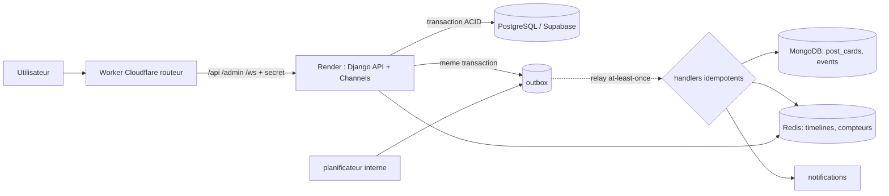

# ARCHITECTURE_DATA — LE BAOBAB

## 1. Principe : une seule source de verite par donnee

| Domaine | Source de verite | Read-model / projection | Cache / ephemere | Reconstruction |
|---|---|---|---|---|
| Identite, profils, amis, groupes | PostgreSQL | — | Redis : cache de permissions (TTL 120 s) | n/a (c'est la verite) |
| Messages | PostgreSQL (`seq` par trigger) | — | Redis : presence, typing, non-lus chauds, channel layer | non-lus : `message_seq - last_read_seq` |
| Posts, commentaires, reactions, statuts | PostgreSQL | MongoDB `post_cards` | Redis : timeline (ZSET d'IDs), compteurs de vues | `feed.rebuild_timeline`, `feed.hydrate` |
| Notifications | PostgreSQL | — | Redis : compteur non-lus, push WebSocket | recompte depuis PG |
| Audit, moderation | PostgreSQL (tables append-only) | — | — | n/a |
| Evenements analytiques | MongoDB `events` (TTL) | PG `analytics_daily_metric`, vues materialisees | — | agregats recalculables (`refresh_metrics`) |
| Idempotence | PostgreSQL `core_idempotency_record` | — | Redis : verrou court (anti double-clic) | la base fait foi |

Regle d'or : **Redis n'est jamais la seule copie d'une donnee**. Chaque cle Redis a un TTL (verifie par test) ou est reconstructible.

## 2. Flux

Ecriture typique (publier un post) : `create_post` ecrit post + medias + hashtags + **evenement outbox** dans UNE transaction PostgreSQL.
Le relais (`relay_outbox`, thread interne toutes les 3 s tant que le service est eveille) projette ensuite la carte dans MongoDB, pousse l'ID dans les timelines Redis, et cree les notifications.
Si MongoDB ou Redis sont indisponibles, l'ecriture reussit ; l'evenement est rejoue avec backoff (8 essais) puis marque `failed` (visible dans l'admin).

## 3. Coherence

| Donnee | Modele | Pourquoi |
|---|---|---|
| Paiement, commande, adhesion, droits | **Forte** (transaction + contraintes UNIQUE + `select_for_update`) | un doublon coute de l'argent ou ouvre un acces |
| Compteurs de likes/commentaires | Forte en base (triggers) ; **eventuelle** dans la carte Mongo | affichage tolere quelques secondes de retard |
| Vues | Eventuelle (Redis -> flush minute) | volume |
| Typing | Ephemere (TTL 6 s) | jamais persiste |
| Analytics | Eventuelle | agregats recalculables |
| Visibilite d'un post | **Toujours re-verifiee en base** a la lecture du feed | une timeline Redis perimee ne doit jamais faire fuiter un contenu |

## 4. Decisions qui corrigent le cahier des charges initial
1. **Messages en PostgreSQL**, pas MongoDB : ordre total par conversation, autorisation par jointure, integrite. Redis n'est que temps reel.
2. **`MessageRead` remplace par des pointeurs** (`last_read_seq`, `last_delivered_seq`) : O(membres) au lieu de O(messages x membres).
3. **Like et Reaction fusionnes** (un like = reaction de type `like`). **Technology = Skill**.
4. **Pas d'app `channels`** (conflit avec le paquet Django `channels`) : les channels vivent dans `community`.
5. **`APIRequestLog` en MongoDB + TTL 30 j**, pas en PostgreSQL (volume, faible valeur individuelle).
6. **Modele d'amitie : une ligne par paire** (`user_low < user_high`), pas deux lignes miroir.
7. Index (conversation, -seq) **supprime** : la contrainte UNIQUE(conversation, seq) fournit deja l'index (verifie par `EXPLAIN` dans les tests).

## 5. Monolithe modulaire -> microservices
Regles appliquees : pas de FK entre domaines "lointains" (references par UUID : `classroom_ref`, `ref_id`), evenements outbox plutot qu'appels directs,
`moderation` ne connait aucun autre domaine (registre de hooks), services/selectors comme seules interfaces.
Extractions probables dans l'ordre : `messaging` (WebSocket intensif) -> `notifications` -> `analytics` -> `advertising`.
Les evenements de l'outbox deviennent alors des messages vers un broker (Queues Cloudflare, Kafka, ...) sans reecrire les producteurs.

## 6. Perimetre de cette tranche
Implemente : core, accounts, profiles, friends, community, messaging, social, notifications, audit, moderation, integrations, analytics.
**Non implemente (tranches suivantes)** : education/LMS, marketplace/paiements, jobs/freelance/portfolio/companies, advertising, AI Gateway.
